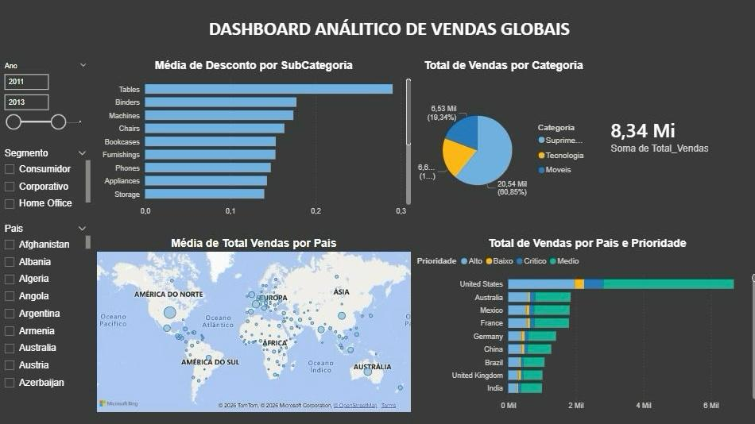

  

# Dashboard Analítico de Vendas Globais

## Sobre o Projeto
Este projeto consiste em um dashboard analítico de vendas globais, desenvolvido com foco em prática e exploração de dados no Power BI.
O objetivo é visualizar o desempenho de vendas em diferentes dimensões, permitindo análises por produto, país e características das vendas.

## Ferramentas Utilizadas
- **Power BI** (Visualização e Modelagem)
- **GitHub** (Versionamento e Portfólio)

## Base de Dados
Foi utilizada uma base de dados estruturada, com análise realizada diretamente no Power BI para transformar dados brutos em informações estratégicas.

## Indicadores (KPIs)
O dashboard apresenta os seguintes indicadores principais:
- **Valor total de vendas**
- **Quantidade de vendas por categoria de produto**
- **Quantidade de vendas por país** (considerando prioridade de entrega)
- **Média de desconto por subcategoria**
- **Países com maior média de valor de venda**

##  Visualizações e Recursos
O dashboard inclui:
- **Gráficos de barras e colunas**: Comparação de vendas por categoria e subcategoria.
- **Mapa geográfico**: Destaque visual do desempenho global por país.
- **Cartões de indicadores**: Visualização rápida de valores totais.
- **Filtros Interativos**: Segmentação por **Ano**, **Segmento** e **País**.

## Objetivo de Aprendizado
Este projeto foi desenvolvido para consolidar conhecimentos em:
- Criação de visualizações dinâmicas.
- Organização de indicadores (KPIs) de negócio.
- Uso de filtros interativos para exploração de dados.
- Versionamento de projetos de BI utilizando o formato **.pbip**.

---
*Projeto desenvolvido para fins de estudo e portfólio.*
